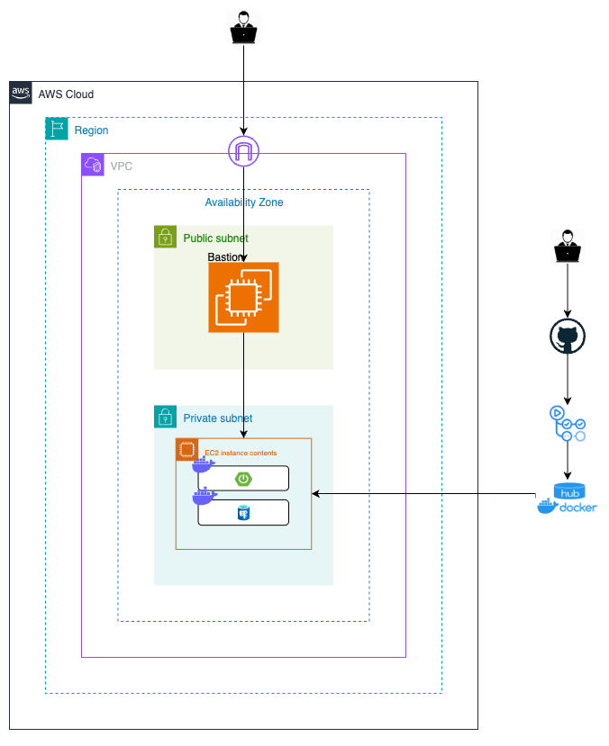

📦 Terraform AWS Infrastructure (VPC, Bastion, App EC2)
AWS에 CI/CD가 가능한 네트워크 인프라(VPC, Public/Private Subnet, Bastion, App Server) 구축용 테라폼 코드

📁 Project Structure
terraform/
├── main.tf
├── variables.tf
├── outputs.tf
├── provider.tf
├── vpc/
│   ├── main.tf
│   ├── variables.tf
│   └── outputs.tf
├── security/
│   ├── main.tf
│   ├── variables.tf
│   └── outputs.tf
├── ec2/
│   ├── main.tf
│   ├── variables.tf
│   └── outputs.tf

🌎 What is included?
VPC: 192.168.0.0/16

Public Subnet (for Bastion host)

Private Subnet (for Application EC2)

Internet Gateway, NAT Gateway

Security Groups (Bastion, App)

EC2: Bastion(퍼블릭), App(프라이빗)

확장성: 여러 AZ, RDS, S3, ALB 등 추가 용이한 구조

🚀 How to Use
1. AWS Credentials 설정
CLI에 AWS IAM 계정(적절한 권한)의 Access Key를 먼저 등록
aws configure

2. Terraform 환경 준비
cd terraform
terraform init        # 플러그인, 모듈 등 초기화
terraform plan        # 리소스 생성 계획 확인
terraform apply       # 실제 인프라 생성 (변경 승인 필요시 -auto-approve 옵션 추가)

3. 변수/설정
variables.tf에서 VPC CIDR, Key Name, AMI ID 등 필요 값 지정
(운영환경에 따라 별도 .tfvars 파일 활용 추천)

4. 생성 후 확인
terraform output 으로 주요 리소스(바스천 public IP, 앱서버 프라이빗 IP 등) 확인

AWS Console에서도 리소스 자동 생성 확인 가능

📝 Terraform 주요 명령어
명령어	설명
terraform init	플러그인, 백엔드, 모듈 초기화
terraform plan	실제 적용 전 리소스 변경사항 미리 보기
terraform apply	실제 인프라 생성/변경
terraform destroy	인프라 리소스 모두 삭제
terraform output	출력 변수값 확인
terraform fmt	코드 포맷팅(정렬)
terraform validate	코드 문법 및 구성체크

📌 Tips
Key Pair: EC2용 키페어를 AWS에서 미리 생성하여 variables.tf에 입력

보안그룹: 바스천→앱서버만 22포트 허용(외부 접근 차단)

모듈 구조: 추후 멀티 AZ, RDS, S3, ALB 등 손쉽게 확장 가능

배포 자동화: CI/CD와 연계 시, 바스천에서만 앱서버 관리/배포하도록 권장

tfstate 관리: 팀 협업 시 원격 state(S3+DynamoDB 등) 강력 추천

🖼️ Architecture
[User PC] -> [Bastion Host(Public Subnet)] -> [App Server(Private Subnet)]
   |                        |
   |----> AWS Console       |----> NAT Gateway/Internet Gateway
(CI/CD 및 GitHub Actions → DockerHub → Bastion → App 서버로 배포)
